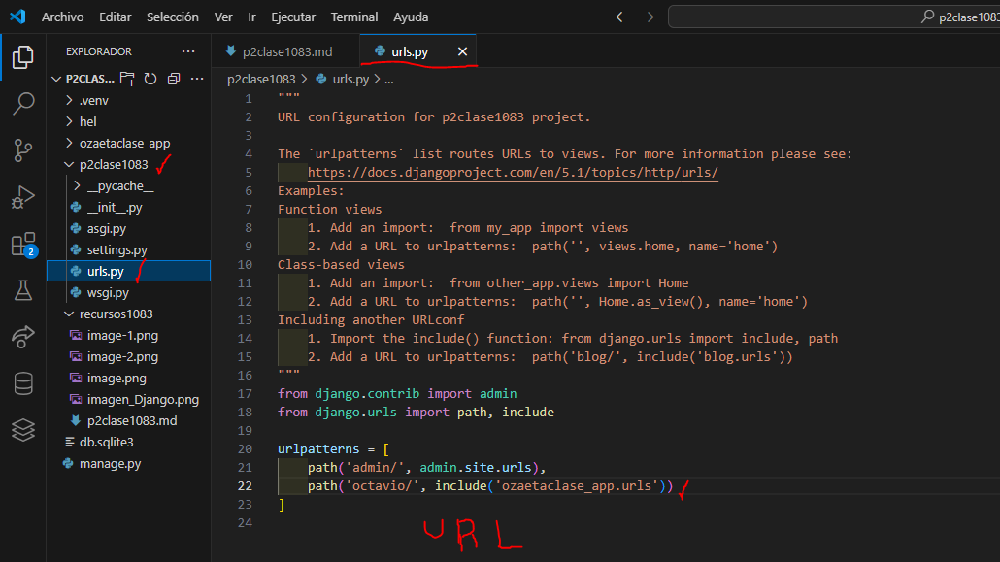

- Crear aplicacion ozaetaclase_app
- comando --> python manage.py startapp ozaetaclase_app
- creamos el archivo urls.py en ozaetaclase_app 
- 
- En setting.py p2clase1083 
- 
- En urls.py de p2clase1083
- 
- En urls.py en ozaetaclase_app
- 
- En views.py en ozaetaclase_app
- 
- En urls.py ozaetaclase_app
- 